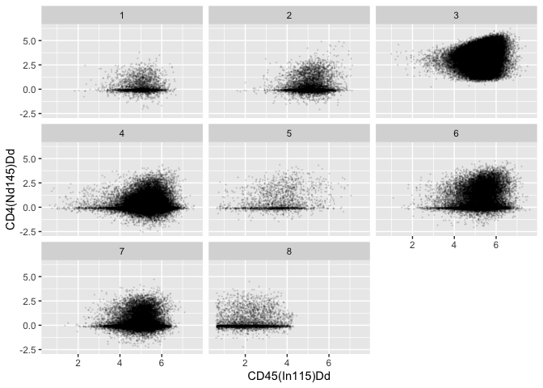

<!-- README.md is generated from README.Rmd. Please edit that file -->

# tidyFlowCore

<!-- badges: start -->

[](https://github.com/keyes-timothy/tidyFlowCore/actions)
[](https://lifecycle.r-lib.org/articles/stages.html#experimental)
[](https://app.codecov.io/gh/keyes-timothy/tidyFlowCore?branch=main)
[](https://github.com/keyes-timothy/tidyflowCore/issues)
[](https://github.com/keyes-timothy/tidyflowCore/pulls)
<!-- badges: end -->

`tidyFlowCore` is an R package that bridges the gap between flow
cytometry analysis using the `flowCore` package and the tidy data
principles advocated by the `tidyverse.` It provides a suite of
`dplyr`-, `ggplot2`-, and `tidyr`-like verbs specifically designed for
working with `flowFrame` and `flowSet` objects as if they were tibbles;
however, your data remain `flowCore` `flowFrame`s and `flowSet`s under
this layer of abstraction.

Using this approach, `tidyFlowCore` enables intuitive and streamlined
analysis workflows that can leverage both the Bioconductor and tidyverse
ecosystems for cytometry data.

## Installation instructions

Get the latest stable `R` release from
[CRAN](http://cran.r-project.org/). Then install `tidyFlowCore` from
[Bioconductor](http://bioconductor.org/) using the following code:

``` r
if (!requireNamespace("BiocManager", quietly = TRUE)) {
    install.packages("BiocManager")
}

BiocManager::install("tidyFlowCore")
```

And the development version from
[GitHub](https://github.com/keyes-timothy/tidyflowCore) with:

``` r
BiocManager::install("keyes-timothy/tidyFlowCore")
```

## Example

`tidyFlowCore` allows you to treat `flowCore` data structures like tidy
`data.frame`s or `tibbles`. It does so by implementing dplyr, tidyr, and
ggplot2 verbs that can be deployed directly on the `flowFrame` and
`flowSet` S4 classes.

In this section, we give a brief example of how `tidyFlowCore` can
enable a data analysis pipeline to use all the useful functions of the
`flowCore` package and many of the functions of the `dplyr`, `tidyr`,
and `ggplot2` packages.

### Load required packages

``` r
library(tidyFlowCore)
library(flowCore)
```

### Read data

``` r
# read data from the HDCytoData package
bcr_flowset <- HDCytoData::Bodenmiller_BCR_XL_flowSet()
#> see ?HDCytoData and browseVignettes('HDCytoData') for documentation
#> loading from cache
```

### Data transformation

The `flowCore` package natively supports multiple types of data
preprocessing and transformations for cytometry data through the use of
its `tranform` class.

For example, if we want to apply the standard arcsinh transformation
often used for CyTOF data to our current dataset, we could use the
following code:

``` r
asinh_transformation <- flowCore::arcsinhTransform(a = 0, b = 1/5, c = 0)
transformation_list <- 
  flowCore::transformList(
    colnames(bcr_flowset), 
    asinh_transformation
  )

transformed_bcr_flowset <- flowCore::transform(bcr_flowset, transformation_list)
```

Alternatively, we can also use the `tidyverse`’s functional programming
paradigm to perform the same transformation. For this, we use the
mutate-across framework via `tidyFlowCore`:

``` r
transformed_bcr_flowset <- 
  bcr_flowset |>
  dplyr::mutate(across(-ends_with("_id"), \(.x) asinh(.x / 5)))
```

### Cell type counting

Suppose we’re interested in counting the number of cells that belong to
each cell type (encoded in the `population_id` column of `bcr_flowset`)
in our dataset. Using standard `flowCore` functions, we could perform
this calculation in a few steps:

``` r
# extract all expression matrices from our flowSet 
combined_matrix <- flowCore::fsApply(bcr_flowset, exprs)

# take out the concatenated population_id column 
combined_population_id <- combined_matrix[, 'population_id']

# perform the calculation
table(combined_population_id)
#> combined_population_id
#>     1     2     3     4     5     6     7     8 
#>  3265  6651 62890 51150  1980 18436 24518  3901
```

`tidyFlowCore` allows us to perform the same operation simply using the
`dplyr` package’s `count` function:

``` r
bcr_flowset |> 
  dplyr::count(population_id)
#> # A tibble: 8 × 2
#>   population_id     n
#>           <dbl> <int>
#> 1             1  3265
#> 2             2  6651
#> 3             3 62890
#> 4             4 51150
#> 5             5  1980
#> 6             6 18436
#> 7             7 24518
#> 8             8  3901
```

And `tidyFlowCore` also makes it easy to perform the counting broken
down by other variables in our metadata:

``` r
bcr_flowset |> 
  # use the .tidyFlowCore_identifier pronoun to access the name of 
  # each experiment in the flowSet 
  dplyr::count(.tidyFlowCore_identifier, population_id)
#> # A tibble: 128 × 3
#>    .tidyFlowCore_identifier           population_id     n
#>    <chr>                                      <dbl> <int>
#>  1 PBMC8_30min_patient1_BCR-XL.fcs                1    31
#>  2 PBMC8_30min_patient1_BCR-XL.fcs                2   112
#>  3 PBMC8_30min_patient1_BCR-XL.fcs                3   761
#>  4 PBMC8_30min_patient1_BCR-XL.fcs                4  1307
#>  5 PBMC8_30min_patient1_BCR-XL.fcs                5     5
#>  6 PBMC8_30min_patient1_BCR-XL.fcs                6   127
#>  7 PBMC8_30min_patient1_BCR-XL.fcs                7   444
#>  8 PBMC8_30min_patient1_BCR-XL.fcs                8    51
#>  9 PBMC8_30min_patient1_Reference.fcs             1    52
#> 10 PBMC8_30min_patient1_Reference.fcs             2   132
#> # ℹ 118 more rows
```

### Nesting and unnesting

`flowFrame` and `flowSet` data objects have a clear relationship with
one another in the `flowCore` API - essentially nested `flowFrame`s. In
other words, `flowSet`s are made up of multiple `flowFrame`s!

`tidyFlowCore` provides a useful API for converting between `flowSet`
and `flowFrame` data structures at various degrees of nesting using the
`group`/`nest` and `ungroup`/`unnest` verbs. Note that in the dplyr and
tidyr APIs, `group`/`nest` and `ungroup`/`unnest` are **not** synonyms
(grouped `data.frames` are different from nested `data.frames`).
However, because of how `flowFrame`s and `flowSet`s are structured,
`tidyFlowCore`’s `group`/`nest` and `ungroup`/`unnest` functions have
identical behavior, respectively.

``` r
# unnesting a flowSet results in a flowFrame with an additional column, 
# 'tidyFlowCore_name` that identifies cells based on which experiment in the 
# original flowSet they come from
bcr_flowset |> 
  dplyr::ungroup()
#> flowFrame object 'file93123e01cac8'
#> with 172791 cells and 40 observables:
#>                    name               desc     range  minRange  maxRange
#> $P1                Time               Time   2399633    0.0000   2399632
#> $P2         Cell_length        Cell_length        69    0.0000        68
#> $P3      CD3(110:114)Dd     CD3(110:114)Dd      9383  -61.6796      9382
#> $P4       CD45(In115)Dd      CD45(In115)Dd      5035    0.0000      5034
#> $P5        BC1(La139)Dd       BC1(La139)Dd     14306 -100.8797     14305
#> ...                 ...                ...       ...       ...       ...
#> $P36           group_id           group_id         3         0         2
#> $P37         patient_id         patient_id         9         0         8
#> $P38          sample_id          sample_id        17         0        16
#> $P39      population_id      population_id         9         0         8
#> $P40 .tidyFlowCore_name .tidyFlowCore_name        17         0        16
#> 297 keywords are stored in the 'description' slot
```

``` r
# flowSets can be unnested and renested for various analyses
bcr_flowset |> 
  dplyr::ungroup() |> 
  # group_by cell type
  dplyr::group_by(population_id) |> 
  # calculate the mean HLA-DR expression of each cell population
  dplyr::summarize(mean_expression = mean(`HLA-DR(Yb174)Dd`)) |> 
  dplyr::select(population_id, mean_expression)
#> # A tibble: 8 × 2
#>   population_id mean_expression
#>           <dbl>           <dbl>
#> 1             3            3.67
#> 2             7            3.33
#> 3             4            4.33
#> 4             2           87.1 
#> 5             6           88.2 
#> 6             8            3.12
#> 7             1           51.4 
#> 8             5           18.0
```

### Plotting

`tidyFlowCore` also provides a direct interface between `ggplot2` and
`flowFrame` or `flowSet` data objects. For example…

``` r
library(ggplot2)
bcr_flowset |> 
  dplyr::mutate(across(-ends_with("_id"), \(.x) asinh(.x / 5))) |> 
  ggplot(aes(x = `CD45(In115)Dd`, y = `CD4(Nd145)Dd`)) + 
  geom_point(size = 0.1, alpha = 0.1) +
  facet_wrap(facets = vars(population_id))
```



## Citation

Below is the citation output from using `citation('tidyFlowCore')` in R.
Please run this yourself to check for any updates on how to cite
**tidyFlowCore**.

``` r
print(citation('tidyFlowCore'), bibtex = TRUE)
#> To cite package 'tidyFlowCore' in publications use:
#> 
#>   Keyes TJ (2024). _tidyFlowCore: Bringing flowCore to the tidyverse_.
#>   doi:10.18129/B9.bioc.tidyFlowCore
#>   <https://doi.org/10.18129/B9.bioc.tidyFlowCore>,
#>   https://github.com/keyes-timothy/tidyflowCore/tidyFlowCore - R
#>   package version 0.99.0,
#>   <http://www.bioconductor.org/packages/tidyFlowCore>.
#> 
#> A BibTeX entry for LaTeX users is
#> 
#>   @Manual{,
#>     title = {tidyFlowCore: Bringing flowCore to the tidyverse},
#>     author = {Timothy J Keyes},
#>     year = {2024},
#>     url = {http://www.bioconductor.org/packages/tidyFlowCore},
#>     note = {https://github.com/keyes-timothy/tidyflowCore/tidyFlowCore - R package version 0.99.0},
#>     doi = {10.18129/B9.bioc.tidyFlowCore},
#>   }
```

Please note that the `tidyFlowCore` was only made possible thanks to
many other R and bioinformatics software authors, which are cited either
in the vignettes and/or the paper(s) describing this package.

## Code of Conduct

Please note that the `tidyFlowCore` project is released with a
[Contributor Code of
Conduct](http://bioconductor.org/about/code-of-conduct/). By
contributing to this project, you agree to abide by its terms.

## Development tools

- Continuous code testing is possible thanks to [GitHub
  actions](https://www.tidyverse.org/blog/2020/04/usethis-1-6-0/)
  through *[usethis](https://CRAN.R-project.org/package=usethis)*,
  *[remotes](https://CRAN.R-project.org/package=remotes)*, and
  *[rcmdcheck](https://CRAN.R-project.org/package=rcmdcheck)* customized
  to use [Bioconductor’s docker
  containers](https://www.bioconductor.org/help/docker/) and
  *[BiocCheck](https://bioconductor.org/packages/3.17/BiocCheck)*.
- Code coverage assessment is possible thanks to
  [codecov](https://codecov.io/gh) and
  *[covr](https://CRAN.R-project.org/package=covr)*.
- The [documentation
  website](http://keyes-timothy.github.io/tidyFlowCore) is automatically
  updated thanks to
  *[pkgdown](https://CRAN.R-project.org/package=pkgdown)*.
- The code is styled automatically thanks to
  *[styler](https://CRAN.R-project.org/package=styler)*.
- The documentation is formatted thanks to
  *[devtools](https://CRAN.R-project.org/package=devtools)* and
  *[roxygen2](https://CRAN.R-project.org/package=roxygen2)*.

For more details, check the `dev` directory.

This package was developed using
*[biocthis](https://bioconductor.org/packages/3.17/biocthis)*.
